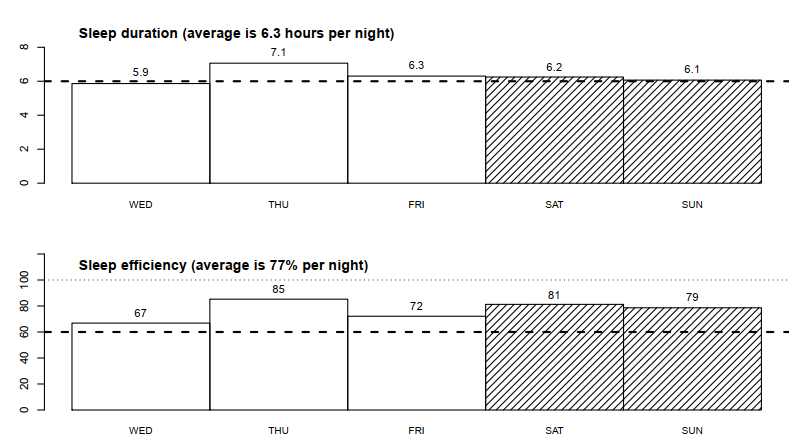
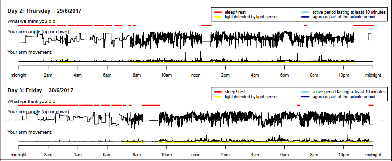
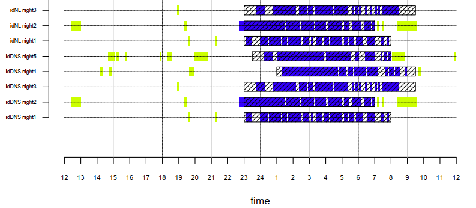

# Introduction

This guide describes how to analyse data from the GENEActiv accelerometers in R.
GGIR is an R package created by Dr Vincent van Hees to process raw accelerometry
data. Van Hees provides a shell function, which can provide a number of
variables for activity and sleep research, requiring only the specification of
input and output folder locations, as well as a few other small adjustments. The
signal processing includes automatic calibration, detection of abnormal values,
detection of non-wear and calculation of average acceleration. GGIR then uses
this information estimate physical activity, inactivity and sleep. The result is
a number of .csv and .pdf files containing relevant variables.

This package has been used by a number of research groups around the world, and a list of publications
using/related to GGIR is available here (https://github.com/wadpac/GGIR/wiki/Publication-list). Also
see here https://github.com/wadpac/GGIR/issues for a place where questions about GGIR can be asked.
Questions are usually answered by the author or another user of GGIR. If you run into a problem it’s a good
idea to check here, as someone else may have had the same issue and found a solution.

This guide was made using version 1.9-2 of GGIR.

# Analysis Instructions

## Step 1: Organise your folders

I would recommend creating one folder to contain all parts of your analysis, named in the following way:

> [date]\_[your-name]_[keyword-for-your-study]

So my folder name would be:

> 2019-08-02_Amy-Hodgson_example

Within this folder create a folder for your scripts, one for your raw data, and another for the results that will be produced. I suggest naming these in the same pattern as the previous folder. In this guide, the folder containing the raw data will be named *Date_Name_Data*, the folder containing the results will be called *Date_Name_Output*, and the folder containing the sleep diary is called *Date_Name_Logs*. 

## Step 2: Get your data

Download the raw .bin files produced by the GENEActiv software, and save all of these files in your *Date_Name_Data* folder. Make sure you have specified appropriate unique IDs. If you are using a sleep diary, remember that the ID in the diary must exactly match the data file ID. It is also important to note that GGIR will not work with files converted to epochs with the GENEActiv software, so it is better to simply use the .bin files.

Steps 3 & 4 relate to setting up the sleep diaries for use with GGIR. If you are not using a sleep diary, feel free to skip these steps.

## Step 3: Set up your sleep diary

GGIR can use basic infomation from a sleep diary to improve estimates of sleep parameters. Your sleep log should be set up so that the first column contains the participant IDs and the subsequent columns contain alternating sleep onset and wake times. The timestamps should be in HH:MM:SS format. See the GGIR vignette here (https://cran.r-project.org/web/packages/GGIR/vignettes/GGIR.html#output-part-4) for an example of how this should look. The first row should be column names, and each subsequent row should contain a participant ID and data.

## Step 4: Sleep diary checklist

In my experience, integrating the sleep diary is the part of the script that is most likely to cause problems. However, if you follow the items in this checklist, the risk of errors or other problems will be minimised.

1. Do you have the same number of onset and wake columns in your sleep log as you have days in your actigraphy data? If you have some days missing in the sleep log, still create the right number of columns, but leave them blank. The sleep log that can be entered into the function has only one 'sleep' time, so you must account for whether you have entered bed time or sleep onset when looking at the results.

2. Do the participant IDs from the data file match the IDs in the sleep log? Note: if the `idloc` argument is set to `1`, the program will look for the participant ID in the file header, and if it is set to `2`, it will look for the ID in the letters or numbers before the underscore in the file name. 

3. Is your sleep log file saved as a .csv file?

If you are having problems, check the *I keep getting this error* guide, which described a few possible problems and solutions.

## Step 5: Set up for GGIR shell function

Firstly, load in the packages you will need to run your script.

\vspace{3mm}

```{r, eval = F}

library(GGIR)
library(zoo)

```

Secondly, you will need an R script or RMarkdown file to use for your analysis. I have included an otherwise blank .Rmd including the setup section and shell function in the *shell_function* file in this repository, which can be used as a template. 

The GGIR shell function itself, which is shown in Step 6, requires some input that is easier to specify beforehand. The arguments to specify are:

`datadir` specifies a file path to the data you want to analyse. In most cases you will want to analyse multiple files, and so you should specify the *Date_Name_Data* folder you created earlier to store all of your .bin files from the GeneActiv software. 

`outputdir` specifies the path to the folder where you want the analysed data to be stored. In this case it is the folder called *Date_Name_Output*.

`studyname` specifies the name of the study, which will determine the name of the folder containing the analysed data (within the *Output* folder).

`loglocation` should be the path to the location of your sleep log. Don't forget to include the file extension, which should be `.csv`, as the sleep log file should be saved in this format. 

`nnights` is the number of nights in your data.

\vspace{3mm}

```{r, eval = F}

datadir <- "C:/Users/amyho/OneDrive/Documents/GENEActiv/Date_Name_Data"
outputdir <- "C:/Users/amyho/OneDrive/Documents/GENEActiv/Date_Name_Output"
studyname <- "Date_Name_Keyword"
loglocation <- "C:/Users/amyho/OneDrive/Documents/GENEActiv/Logs/Date_Name_Sleeplogs.csv"

nnights <- 5 

```

You may also wish to specify the following arguments, which are explained in the comments.

```{r, eval = F}

f0 <- 1 # File to start with (default = 1)
f1 <- 4 # File to finish with (default = number of files available)

```

If you have problems due to the file paths, there is some advice for potential solutions in the error guide.

## Step 6: The shell function

This function may seem very long, but if you have specified the variables above, there should be very few changes that need to be made in most circumstances. If you are not using a sleep log, remove the `loglocation` argument from the function. If your study involves assessing physical activity and you want to alter the thresholds, or you want more information about any of these arguments, each is described in more detail in either the vignette or the package documentation.

A couple of arguments to be aware of are `includenightcrit`, which refers to the minimum number of valid hours per night (set by default to 16), and `def.noc.sleep` allows you to specify the time window in which sustained activity will be interpreted as sleep, only used if there is no sleep log.

An example of the GGIR shell function is shown below. Different versions of this function can be found in the package vignette and documentation, and this can be changed to suit your purposes, but this is the version I have included in the template. When you have  the shell function below your setup code, and are happy with how it is set up, you should be ready to run your analysis. Simply run the code and it should begin processing your data. Depending on how many participants you have, and the computer you are using, this may take quite a long time- perhaps even several hours. Do not be concerned by this, the script will stop and produce an error message if there is a problem. However if your computer crashes, you may need to find a more powerful computer to run your analysis.

\vspace{3mm}

```{r, eval=F}
g.shell.GGIR(
             mode=c(1,2,3,4,5),
             datadir = datadir, 
             outputdir = outputdir,
             idloc = 2, 
             f0=f0, f1=f1,
             studyname = studyname, 
             #-------------------------------
             # Part 1:
             #-------------------------------
             do.enmo = TRUE,            do.anglez=TRUE,
             chunksize=1,                printsummary=TRUE,
             #-------------------------------
             # Part 2:
             #-------------------------------
             strategy = 1,               ndayswindow=7,
             hrs.del.start = 0,          hrs.del.end = 0,
             maxdur = 9,                 includedaycrit = 16,
             winhr = c(5,10),
             qlevels = c(c(1380/1440),c(1410/1440)),
             qwindow=c(0,24),
             ilevels = c(seq(0,400,by=50),8000),
             mvpathreshold =c(100,120),
             bout.metric = 4,
             closedbout=FALSE,
             #-------------------------------
             # Part 3:
             #-------------------------------
             timethreshold= c(5),        anglethreshold=5,
             ignorenonwear = TRUE,
             #-------------------------------
             # Part 4:
             #-------------------------------
             excludefirstlast = FALSE,
             includenightcrit = 16,
             def.noc.sleep = c(), 
             loglocation= loglocation,
             outliers.only = FALSE,
             criterror = 4,
             relyonsleeplog = FALSE, sleeplogidnum = FALSE,
             colid=1, coln1=2,
             do.visual = TRUE,
             nnights = nnights,
             #-------------------------------
             # Part 5:
             #-------------------------------
             threshold.lig = c(30), threshold.mod = c(100),  threshold.vig = c(400),
             boutcriter = 0.8,      boutcriter.in = 0.9,     boutcriter.lig = 0.8,
             boutcriter.mvpa = 0.8, boutdur.in = c(1,10,30), boutdur.lig = c(1,10),
             boutdur.mvpa = c(1),   timewindow = c("WW"),
             #-----------------------------------
             # Report generation
             #-------------------------------
             do.report=c(2,4,5), visualreport=TRUE, 
             dofirstpage = TRUE, viewingwindow=1
             )
```


## Step 7: Check your data

Once the function has run successfully, it is a good idea to check your data for any mistakes or problems. Firstly, if you have used a sleep log, the 'sleeplog_used' column of the part 4 output should say TRUE. If it is FALSE, this means that there has been a problem- you may have made a mistake specifying the location of the sleep log, or there may have been an issue with matching the IDs.

Secondly, there is an option to run the script and visualise only outliers. By default `outliers.only` is set to `FALSE`, but if you change this to `TRUE`, only nights with a difference in onset or waking time larger than `criterror` will be visualised, allowing you should be able to see any potentially abnormal values in your output.

# Interpreting the Output

Once you have run the GGIR shell function successfully, the results section of your output folder should contain two further folders:

- file summary reports
- QC
  
And the following files:

- part2_daysummary.csv
- part2_summary.csv
- part4_nightsummary_sleep_cleaned.csv
- part4_summary_sleep_cleaned.csv
- part5_daysummary...
- part5_personsummary...
- visualisation_sleep.pdf

I will briefly describe this output and how to interpret it. The variables you will be interested in are mostly in the part 2, 4 and 5 .csv files.

## file summary reports

In this folder are pdf files containing graphs of some key variables (sleep duration, sleep efficiency etc), and actograms showing activity patterns across each day. There should be one for each participant. Below is an example of the graphs and actograms.

```{r, echo = F, fig.align = 'center'}


```


## QC

This folder contains a .csv file *data_quality_report* containing variables describing data quality, the full version of the part 4 .csv files, and a .pdf *plots_to_check_data_quality_1* with plots indicating data quality across the measurement period. The R session info is also in this folder. 

## Part 2 .csv files

You should see files named *part2_daysummary.csv* and *part2_summary.csv*. The *daysummary* file shows variables for each participant for each day, while the *summary* file shows the variables averaged for each participant. A few key variables for this section are below. There are also many physical activity variables in the GGIR outout, but I will focus more on those relevant to sleep.


Variable                   |    Description
---------------------------|----------------------------------------------------------------------------------------------------------
ID                         | Participant ID
                           |
Start_time                 | Start time of the recording period
                           |
Samplefreq                 | Sampling frequency (Hz)
                           |
IV_Intradailyvariability   | Intra-daily variability
                           |
IS_Interdailystability     | Inter-daily stability
                           |
N valid hours              | Number of hours with valid data during the day

## Part 4 .csv files

Part 4 provides a lot of the sleep variables. There are two part 4 files, *part4_nightsummary_sleep_cleaned.csv*, which gives daily output and *part4_summary_sleep_cleaned.csv* which gives output summarised for each participant. 

**Important note from documentation:** "Please interpret sleeplog as the method to derived the Sleep Period Time (SPT) window derived from (as applicable): sleeplog, HDCZA algorithm, L5R6 algorithm, or specified by researcher as a constant time interval."

For more information on how the 'SPT window' is calculated in the absence of a sleep log, see van Hees (2018) *Scientific Reports*.

Key variables from the part 4 output: 

Variable                        |    Description
--------------------------------|-----------------------------------------------------------------------------------------------------
Acc_onset/wake                  | Detected sleep onset/wake expressed as hours since the previous night (sleep and wake times are also available as a timestamp- e.g. acc_onset_ts)                            
                                |
Sleeplog_onset/wake             | Sleep onset/wake derived from the sleep log 
                                |
Error_onset/wake/dur            | Difference between sleep onset/wake/duration as estimated by accelerometer and estimated by sleep log/defined by researcher        
                                |
sleeplog_SptDuration            | Difference between onset and waking time (sleep log).
                                |
acc_SptDuration                 | Difference between onset and waking time (accelerometry).
                                |
acc_SleepDurationInSpt          | Total sleep duration, which equals the accumulated nocturnal sustained inactivity bouts within the Sleep Period Time.
                                |
Acc_dur_sibd                    | Accumulated sustained inactivity bouts during the day. These are the periods we would label during the night as sleep, but during the day they form a subclass of inactivity, which may represent day sleep (napping) or wakefulness while being motionless
                                |
Acc_n_noc                       | Number of nocturnal sleep periods
                                |
Acc_nsibd                       | Number of sustained inactivity periods during the day
                                |
Sleeplog_used                   | Whether a sleep log was used (TRUE/FALSE).
                                |
n_nights_complete               | Number of nights complete, which means both accelerometer and sleeplog data. 

## Part 5 .csv files

The *part5_daysummary.csv* gives variables for each participant for each day, and *part5_personsummary.csv* gives the variables summarised by participant. Key variables:

 Variable                        |    Description
---------------------------------|-----------------------------------------------------------------------------------------------------
dur_nightsleep_min               | Sleep duration in minutes
                                 |
dur_nightwak...                  | Night waking time
                                 |
sleep_efficiency                 | Sleep efficiency
                                 |
L5.../M10...                     | Variables relating to the least active 5 and most active 10 hours. Numbers may vary based on GGIR parameters (winhr). Some further L5 and M10 variables in part 2 output.

For a more complete description of the variables available, please see the GGIR documentation here: https://cran.r-project.org/web/packages/GGIR/GGIR.pdf. 

A dictionary of some key variables is also available here: https://cran.r-project.org/web/packages/GGIR/vignettes/GGIR.html


## visualisation_sleep.pdf

This file contains a graph showing sustained inactivity, which is produced if `do.visual = TRUE` in the shell function. Each line represents a single night. If there are multiple participants in the dataset, all will be included on the graph. The black hatched boxes are the sleep periods as defined by the sleep log (or in the absence of the sleep log, this seems to be a sleep window estimated from accelerometry). The blue colour is sustained inactivity bouts within this window, and the yellow/green colour is sustained inactivity bouts outside of this window. This visualisation is primarily useful to spot outliers (if outliers.only = TRUE in the GGIR shell function) which may indicate a problem in sleep estimates.

```{r,echo=FALSE, fig.align='center'}

```


## Working with the output

Sometimes you may want to combine data from different sets of GGIR output, or combine different parts of GGIR output. This is not difficult, but I wrote a couple of functions to make it easier in a package called easyGGIR that can be downloaded from my github here https://github.com/amyr-hodgson.

Hopefully this guide has been helpful, and good luck with your analysis.
